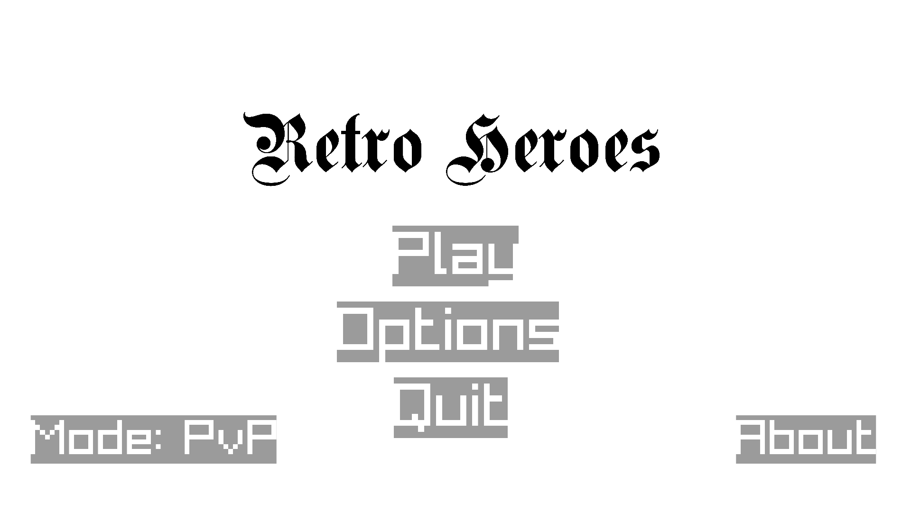
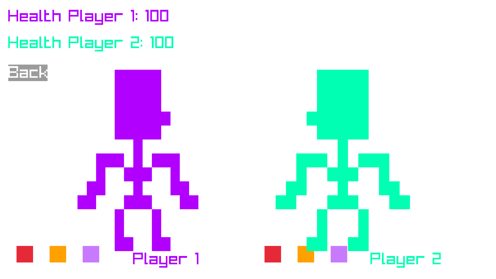

# Retro Heroes

## Introduction
Retro Heroes is a turn-based 2-player RPG game written in C++.

    

## Objective
The objective of the game is to defeat the other hero by using one's own abilities.

## Features

The game has two modes:

* PvP - you can fight with a player (they use a different set of keys)

* PvE - you can fight with a bot (entity)

Each player starts off with `100 HP`, a random color to distinguish him from the other player and **three** abilities to choose from:

* `Attack` - the player deals 10 damage to the opponent, but cannot deal any more damage after the opponent reaches 0 HP.

* `Heal` - the player heals 10 hit points, but cannot heal over the limit of 100 HP

* `Special Attack` - the player deals 20 damage to the opponent, but cannot deal any more damage after the opponent reaches 0 HP.

Each turn, one player can pick only one ability.

The player wins when the other player reaches 0 HP.

    

## How do I play?

You can play the game on <a href="https://andrewstephen.xyz/retro-heroes">my website</a> or you may self-host the game locally using a simple HTTP server such as `python -m http.server` or `XAMMP`.

The game can also be run on native platforms, such as `Windows` and `Linux`, by using the compilation script in the `/src` folder. Currently the script is written for `Arch Linux`, but it could be adapted for other platforms by following the <a href="https://github.com/raysan5/raylib/wiki#development-platforms">Raylib documentation</a>.
